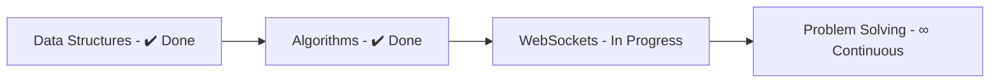

# **Ahmed Ashraf**  
### *High School Developer in the Making*  

```javascript
// Animated ASCII Art
const devArt = `
   _____                 _ 
  / ____|               | |
 | |  __  ___   ___   __| |
 | | |_ |/ _ \\ / _ \\ / _\` |
 | |__| | (_) | (_) | (_| |
  \\_____|\\___/ \\___/ \\__,_|
  
  Code flows in my veins since 7th grade!
`;
console.log(devArt);
```

<div align="center">
  
[](https://git.io/typing-svg)

</div>

## **🔥 Tech Stack**  

### **Frontend Development**  
<p align="center">
  
  
  
  
  
</p>

### **Backend Development**  
<p align="center">
  
  
  
  
  
</p>

## **📚 Current Learning Journey**  



## **📊 GitHub Stats**  

<div align="center">
  
[](https://github.com/ma9737149)
[](https://github.com/ma9737149)

</div>

## **🌐 Connect With Me**  

<div align="center">

[](https://discord.com/users/1137157616804573376)
[](https://github.com/ma9737149)
[](https://leetcode.com/ma9737149)


</div>

<div align="center">
  
[](https://github.com/ma9737149)
  
</div>

<details>
<summary>✨ Click for Coding Philosophy!</summary>
<br>
  
```python
def coding_philosophy():
    return "Every line of code is a step towards mastery!"
```
  
</details>
